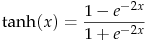
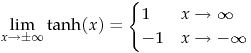
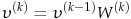
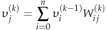
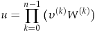

# *Neural Network training method using a Genetic Algorithm*
 ---
## Overview of the project
In this project the Neural Network has been applied to a self-driving vehicle, as a consequence each car is an individual of the population. The scope of this work is to obtain a human control independent driving car, capable of adapting to different paths based on a defined Genetic Algorithm *fitness function ( ff )*. 

### Vehicle overview     
The movement of the car is simulated by a movement control script developed in Unity having the following simple algorithm:
```
            netInput <- SenseWorld
            netOutput <- neuralNet.Process : netInput
            ApplyMovement
```
Furthermore, to handle the vehicle suspension physic and the actual application of the motor and the steering force, a simple script has been developed.
        
        
## Implementing the Neural Network *(Net)*
The Net has been implemented in a highly versatile way, meaning that it is capable of handling any topology provided the condition that **given any two adjacent Net layer, they form a complete graph**. One of the purpose of this specific implementation was to highlight the different behaviour of different topologies.            
The Net class has been implemented with the purpose to encapsulate exclusively the processing of the inputs and, since the Nets are not properly trained but instead selected with a Genetic Algorithm, there was no need to implement the learning functionality of the Net. Thanks to these project choices the Net class turned out to be really clean and brief, incapsulating only the processing algorithm.           
     
**DNA**       
The Genetic Algorithm training requires a way to encode each individual information (DNA), therefore a class implementing the encoding of an individual information is required. There is no predefined way to implement the encoding algorithm, however in this case it is natural to consider the DNA of the Net composed by the topology and the weights of the Net. The DNA class is then responsible for two main functionalities:   
* Mutate
* Crossover
     
          
**Activation function**       
The activation function of a node defines the output of that node given an input or set of inputs.     
Basically it means that the output of each neuron is the Activation Function calculated in the input value. In this project the Activation Function is identified by the Hyperbolic Tangent:        

<p align="center">
    
</p>

because of the following convenient property, it is assured that the output of each neuron, and so each element of the output vector of the Net, is going to be bounded between -1 and 1    

<p align="center">
    
</p>      
      
         
### Basic Neural Net mathematics       
In the following paragraph, the standard processing method of a Neural Network will be explained.     
With *k* as the Net layer number, *v* as a generic *k-esim* vector and *W* as the *k-esim* weights matrix, the generic propagation equation takes the following recursive form:      
<p align="center">
    
</p>      

Each layer vector is calculated with a multiplication between a row vector and a matrix, the vector element is calculated as follows:    

<p align="center">
    
</p> 

Now with *u* as the output vector, the propagation equation can be written as a sequential multiplication up to *n - 1* with *k = 0 . . . n*, *n* the number of the layers in the Net, the vector at *k = 0* being the input vector and the vector at *k = n* being the output vector:     

<p align="center">
    
</p> 
      

## Genetic Algorithm *(GA)*

A genetic algorithm is a metaheuristic inspired by the process of natural selection. GAs are commonly used to generate high-quality solutions to optimization and search problems by relying on biologically inspired operators.
The GA is based on three main steps:      

**1) Selection**     
**2) Crossover**     
**3) Mutation**    

### Selection
During this step the fitness function *(ff)* is calculated for each individual and the fittest individuals are selected as the designated to pass their DNA to the progeny. Usually, each individual has a certain probability of being selected, proportional to their fitness. In this project, in order to accelerate the convergence to the optimal, at each generation, only the two fittest individual are going to be selected.     

### Crossover
In this step the actual mixing of the DNA is implemented. There is no predefined way to implement this step. In this project the mixing of the DNA only concerns the weight matrices. Since the designated individuals are the two fittest, the DNA is not equally selected from both of them, instead, the fittest one, is responsible of handing down the 2/3 of the DNA. In conclusion the child DNA is copied from the fittest one and then once every three cycles the DNA is selected from the partner. This can easily be implemented as follows:

```C#
   for (int i = 0; i < rows; i++)
   {
       for (int j = 0; j < columns; j++)
       {
           if ((i + j) % 3 == 0)
           {
               childWeights[i][j] = partnerWeights[i][j];
           }
       }
   }
```     

### Mutation
As in nature, each individual has a certain probability of undergoing a mutation. Mutation is implemented as a random change (between -1 and 1) to a weight in one or more weight matrices.     

### GA Process
The process of the algorithm is the following:     
```C#
InstantiateRandomPopulation
OnPopulationEnd -> Selection
Crossover
Mutation
InstantiateNewPopulation
```     

## Future updates      
The next goal is trying to **include non complete adjacent layers graphs** in the project. Furthermore, currently, only the Net weights are taken into consideration in Crossover and Mutation, while the topology is only defined at the start of a simulation. In future update would be nice trying to implement the capability to support also topology Crossover and Mutation.     

## References Source code
*[NeuralNet.cs](/Assets/Scripts/NeuralNet/NeuralNet.cs)*    
*[DNA.cs](/Assets/Scripts/NeuralNet/DNA.cs)*     
*[TrainingManager.cs](/Assets/Scripts/Managers/SuperClasses/TrainingManager.cs)*

