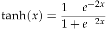
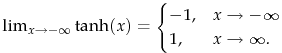

# *Neural Network training method using a Genetic Algorithm*
 ---
## Overview of the project
In this project the Neural Network has been applied to a self-driving vehicle, as a consequence each car is an individual of the population. The scope of this work is to obtain a human control independent driving car, capable of adapting to different paths based on a defined Genetic Algorithm *fitness function ( ff )*. 

### Vehicle overview     

The movement of the car is simulated by a movement control script developed in Unity having the following simple algorithm:
```
            netInput <- SenseWorld
            netOutput <- neuralNet.Process : netInput
            ApplyMovement
```
Furthermore, to handle the vehicle suspension physic and the actual application of the motor and the steering force, a simple script has been developed.
        
        
## Implementing the Neural Network *(Net)*
The Net has been implemented in a highly versatile way, meaning that it is capable of handling any topology provided the condition that **given any two adjacent Net layer, they form a complete graph**. One of the purpose of this specific implementation was to highlight the different behaviour of different topologies.            
The Net class has been implemented with the purpose to encapsulate exclusively the processing of the inputs and, since the Nets are not properly trained but instead selected with a Genetic Algorithm, there was no need to implement the learning functionality of the Net. Thanks to these project choices the Net class turned out to be really clean and brief, incapsulating only the processing algorithm.           
     
**DNA**      
The Genetic Algorithm training requires a way to encode each individual information (DNA) [reftoGA], therefore a class implementing the encoding of an individual information is required. There is no predefined way to implement the encoding algorithm, however in this case it is natural to consider the DNA of the Net composed by the topology and the weights of the Net. The DNA class will be explained in detail later, during the explanation of the Genetic Algorithm.
     
          
**Activation function**       
The activation function of a node defines the output of that node given an input or set of inputs. [ref to activation f] 
Basically it means that the output of each neuron is the Activation Function calculated in the input value. In this project the Activation Function is identified by the Hyperbolic Tangent:        

<p align="center">
    
</p>

because of the following convenient property, it is assured that the output of each neuron, and so each output of the Net, is going to be bounded between -1 and 1    

<p align="center">
    
</p>      

### Basic Neural Net mathematics       


        
**Neural Net class snippets**    
    
Let us have a look at how the processing of the Net is performed and how the inputs "flow" through the Net.    
Considering implemented the following function handling the multiplication of a vector with a matrix and returning the result vector:
```C#
private float[] ActivationVector_Matrix(float[] vector, float[][] matrix, int vectorLength, int matrixColumns)
```
The processing function consequently takes the following form:
```C#
    public float[] Process(float[] inputs)
    {
        //Calculate the fist activation vector I_H0
        float[] firstLayer = ActivationVector_Matrix(inputs, dna.weights.i_h0Weights, dna.topology.inputCount, dna.topology.neuronsPerHiddenLayer);

        //Calculate the second activation vector H0_H1
        float[] current = ActivationVector_Matrix(firstLayer, dna.weights.intraNetWeights[0], dna.topology.neuronsPerHiddenLayer, dna.topology.neuronsPerHiddenLayer);

        //Iterate through all of the remaining NeuralNet hidden layers Hi-1_Hi
        for (int i = 1; i < dna.topology.hiddenLayerCount - 1; i++)
        {
            current = ActivationVector_Matrix(current, dna.weights.intraNetWeights[i], dna.topology.neuronsPerHiddenLayer, dna.topology.neuronsPerHiddenLayer);
        }

        //Calculate the output vector Hn_O
        float[] output = ActivationVector_Matrix(current, dna.weights.hn_oWeights, dna.topology.neuronsPerHiddenLayer, dna.topology.outputCount);

        return output;
    }
```
## Future updates      


## References 
